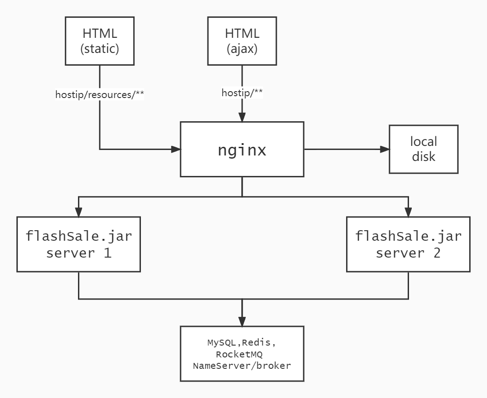

# Flash-Sale-Mall

This project is focused on constructing a high performance backend service for flash sale scenarios, e.g. Black Friday, ticket snatching, where **the backend server may receive an enormous amount of requests in a very short period.**

Basic frontend webpages were also developed to show the process of browsing items & placing orders. (See **Webpages & API** section below)

# Highlights

- Developed an e-commerce application with **Spring Boot** and **Mybatis** that specifically optimized for promo sales.

- Deployed the application to 4 AWS EC2 instance, set up **Nginx** as the **reverse proxy** for application servers and **Redis** for centralized session management
  (1vCPU, 1G RAM per instance; 2 for application, 1 for Nginx and 1 for MySQL & Redis).

- Optimized item query by leveraging **Redis** and local **Guava Cache** to store item detail data to reduce response time and database I/O operation, improved QPS by **1000%** to **5000** (compared to single-instance and no-caching deployment).

- Optimized order creation by storing item stock in Redis and implementing asynchronous transaction of order creation & item stock reduction with **RocketMQ**, ensured final data consistency.

- Set up limited item access tokens and fixed thread pool to flatten excessive number of requests.

- Applied verification code and **Guava Rate Limiter** for anti-scalper.

# Webpages & APIs

- [Login](http://34.235.85.190/resources/login.html)

- [Register](http://34.235.85.190/resources/register.html)

    - [Get verification code](http://34.235.85.190/resources/getotp.html): before register, you will need to enter your (fake) phone number and receive a verification code. (In this demo, the code will be printed in your browser.)

- [Item list](http://34.235.85.190/resources/listItem.html)

    - Through item list, you can get the access to item details and place your order.

    - Only logged in user can place an order.

    - **If you run into failure in creating an order, try the 2 publish promo API below.**

- Publish a promo event

    - [Publish promo 1](http://34.235.85.190/item/publishpromo?id=1)

    - [Publish promo 2](http://34.235.85.190/item/publishpromo?id=3)

    - By publishing a promo, we will store the stock of the item to be sold in this promo in redis

    - Meanwhile, a maximum access limit number will also be set into redis to allow at most this number of people to place orders. By default, the number was set to 5 times of the item stock.

    - By design, these API are created for operators to start their promo event.

- Item detail API: These two api were optimized for item detail query.

    - QPS of these two API reached **5000** (Jmeter test setting: thread group: #threads: 1000, ramp-up period: 5s, Loop count: 30; HTTP request: use keepAlive, port:80).

    - [Item 1 detail API](http://34.235.85.190/item/get?id=1)

    - [Item 2 detail API](http://34.235.85.190/item/get?id=1)

# Application Architecture

